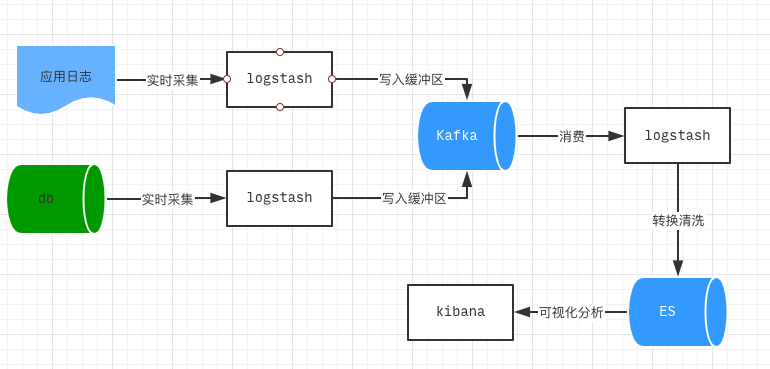
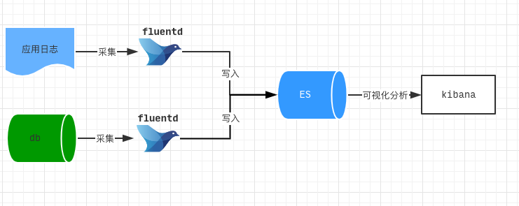

## 日志搜索服务调研

日志数据犹如行车记录仪，记录了应用系统生命周期内发生的各个事件. 应用开发, 运维人员借助日志实现场景还原，调式及问题定位. 针对日志数据的存储及搜索常见的技术方案是采用elasticsearch stack，具体的实现有ELK或是EFK架构

### ELK方案

ELK分别对应elasticsearch, logstash, kibana，三者组合实现数据从采集 -》过滤转换 -》存储及可视化展示的过程

三个模块的功能：

- elasticsearch: 存储日志数据，提供高效的全文搜索功能
- logstash: 实现日志的采集过滤输出
- kibana: 丰富的图表插件，实时展示日志

图1 ELK日志处理流程

常见的ELK技术实现方案如上图所示，流程说明:

- logstash在采集端仅负责实时读取日志数据，并写入kafka缓冲区
- 缓冲区的作用可以避免大数据量并发写入ES集群时发生数据丢失的情况
- logstash进行日志过滤转换时消耗的资源比较多，可单独部署在一个计算节点

上图中日志采集端的logstash可使用filebeat代替，filebeat使用golang编写，相比logstash更轻量，资源消耗更低

### EFK方案

EFK使用的是elasticsearch, fluentd及kibana，与ELK不同的是去掉了logstash，取而代之的是由fluentd完成日志数据的采集，过滤转换输出

fluentd是开源的日志收集器，能实现日志的收集，转换处理及输出，主要的特性：

- 半结构化的数据格式，支持json格式
- 丰富的扩展插件，可自定义输入端/输出端的数据处理
- 最小化使用资源(内存占用小)
- 提供可靠的缓冲(buffer批量处理)

图2 EFK日志处理流程

如上图展示了fluentd从数据收集到写入ES的的处理流程